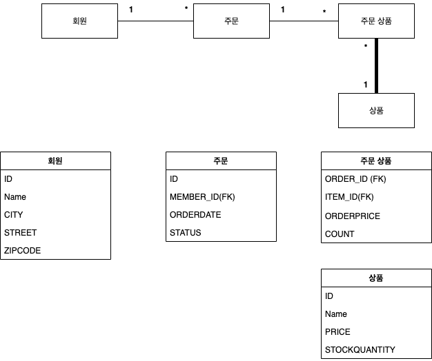

# ORM ?

* ORM 이 필요한 이유

    * 사용자가 수작업으로 적는 쿼리는 오타의 확률도 상당히 높고, 상황에 따라 쿼리를 고치는 것이
    상당히 실수를 유발할 확률이 크다.
    
    * 그리고 내 생각엔 컴퓨터 프로그래밍은 수작업을 자동화 혹은 편리하게 하기 위해 발전한 것으로
    이런 분야에도 적응해야 된다고 생각한다.
    
    * DB 공부와 함께 이곳에 정리한 뒤, 티스토리로 나중에 결집해서 올려보자!
    
# 요구사항 분석(2020-12-16)

* 회원은 상품을 주문할 수 있다.
* 주문 시 여러 종류의 상품을 선택할 수 있다.

* 회원기능
    - 회원 등록
    - 회원 조회
* 상품기능
    - 상품 등록
    - 상품 수정
    - 상품 조회
* 주문기능
    - 상품 주문
    - 주문 내역 조회
    - 주문 취소



## 설계간 든 생각

* 일단 column 의 name 은 underbar 표기법으로 작성한다.
* 최대한 객체 지향에 DB 설계를 엮을 수 있도록 한다.
* 왜? 다른 방식은 없을까? 라는 기본 생각의 토대로 한뒤 공부한다.
* 모든 코드는 설계 이전에 작성하지 않는다.
* 깊게 생각하자 ! 깊게 , 기술에 대한 이해도를 넓히는 과정은 귀찮을 수 있지만 나중에 큰 도움이 된다.
* 객체의 역할은 ClassService.class 로 나타내자!
* 모든 Primary Key 를 가지는 부분에는 **@Column(name = "underbar_case")** 로 나타낸다.
* 객체는 역할, 책임! 그리고 협력으로 이루어진다. => 객체 지향적으로 설계해보자!
* 내 코드는 완벽하지 않다! 피드백은 항상 듣고 무엇이 옳은지 이성적으로 생각하자. 자존심은 발전에 도움이 되지 않는다.
의견을 수용하고 최대한 발전하려고 하자.

## 설계 Entity 구성도

### Member.class

* 회원 Entity 를 나타내는 Class 이다.
* 손님의 역할을 하며, 손님의 회원가입 정보인 **(이름 / 나이 / 도로명 / 도시 코드)** 를 Column 으로 설계하였다.

### Order.class

* 주문을 나타내는 Class 이다.
* 주문서의 역할을 하며, 주문 상품 등 우리가 항상보는 Bill 지의 역할을 한다.
* 이 책은 **김영한 님의 JPA** 를 보고 공부한 내용인데, 나는 Order Class 에 OrderPrice 가 있는게 맞지 않나 싶다.
    * OrderItem 에 OrderPrice 가 있는게 맞는걸까? 생각해보자 왜 OrderItem 에 가격이 있을까?
    * 사실 OrderItem 의 OrderPrice 는 Item 의 Price 를 참조해도 되지않을까?
    * 여기서 문제! 참조를 해야 하는데, 외래키는 사용할 수 없다. 왜냐! 가격이란건 고유하지 않음.
    * 따라서 해당 주문물품에 Mapping 된 "item_id" 를 통하여 해당 물품의 가격을 참조해 오면 됨.
    * 난 주문서의 내용이 Order에 OrderItem 들이 List 들로 뽑혀(1:N 으로 Mapping 되 있으니) 해당 Price 들을 더한
    price 가 있어야 한다고 생각한다. 따라서 해당 Column 을 추가했다.
    * 내 의견이 틀린거일 수 도 있다. 김영한 님이 사실 저렇게 설계하는데는 이유가 있을것, 하지만 일단 내생각대로 해보고 왜 그렇게
    설계하셨는지 생각해보는게 맞다고 판단했다. (이 부분에 대해서 설명해 줄 수 있다면 설명해주시면 감사하겠습니다.)

### OrderItem.class

* 주문한 Item 을 나타낸 클래스 이다.
* 객체 혹은 DB 중심의 설계 모두 N:N 의 관계를 지양한다.
* 일단 OrderPrice 와 Count 는 Join 되어 한번에 Order Data 로 볼수 있게 하면 좋을 것 같다.
* 우리가 생각하는 영수증의 이미지는 아래와 같지 않은가?
```
[Bill!]
[계산 날짜 : 2020-12-16]
[계산 하시는 분 : 정승현]
[계산 품목]
상품      주문 날짜       상태      수량      가격
AAA     2012-12-16  DELIEVERY   3     10,000
BBB     2012-12-16   FINISH     2      5,000

[총합 가격]
도합 : 40,000 원!

```

해당 설계 대로 할것이다. 음 근데 여기서 든 생각은 Order Table 에 Price 를 둬야 하는가? <br>
둬서 이득인 점을 생각해보자.. 일단 User 가 자신이 해당 날짜에 낸 가격을 본다면, 두 가지 방법이 있을 수 있다.<br>
1. Order Table 의 해당 Date 의 price column 을 확인한다. 
2. Order 하나에 Mapping 된 OrderItem 의 orderPrice * Count 를 다 구한다.

**처음 Query 자체는 2번이 빠를 수 있겠으나, 1번 처 한번 저장하고 난 뒤부터는 1번이 속도 측면에서 이득일 것이라고 판단된다.** <br>
따라서 일단은 내 설계 방식대로 설계한다.

### Item Class 

* 사실 Item Class 의 경우 우리가 뭐 마트에서 파는 물품이라 생각한다면, 품목마다 각기 다른 특색들이 있을 수 있을 것 같다.
* 뭐 책과 티비는 상품적으로는 가격 , 카테고리, 이름, 가격, 재고 라는 상품으로서 공통적인 속성을 가진다.
* 만약 카테고리를 한다면 CategoryEnum 로 구현할 것이다.

    
